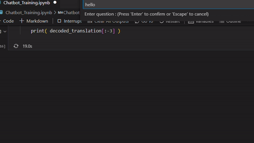

<!--
**ahmedwaleedxx/ahmedwaleedxx** is a ✨ _special_ ✨ repository because its `README.md` (this file) appears on your GitHub profile.

Here are some ideas to get you started:

- 🔭 I’m currently working on ...
- 🌱 I’m currently learning ...
- 👯 I’m looking to collaborate on ...
- 🤔 I’m looking for help with ...
- 💬 Ask me about ...
- 📫 How to reach me: ...
- 😄 Pronouns: ...
- ⚡ Fun fact: ...
-->
<h1 align="center">LSTM Seq2Seq Chatbot Model</h1>
<h3 align="center">A Chatbot model that is focusing on Tourism in Egypt</h3>
 

<!-- 
  

 -->
<!-- 
  
 -->

- 🌱 This model consists of 
- **Encoder**: 
 >   It takes the input sequence and encodes it into a fixed-length vector, which is known as the "context vector" or "thought vector." The encoder is typically composed of a stack of LSTM cells. Each LSTM cell takes an input element from the sequence and updates its internal hidden state and cell state based on the current input and the previous hidden state. This allows the LSTM to capture long-term dependencies and encode the input sequence into a condensed representation.
- **Decoder**:
 >   The decoder takes the context vector generated by the encoder and generates the output sequence one element at a time. Like the encoder, the decoder is also composed of a stack of LSTM cells. However, it has an additional input at each time step, which is the previously generated element of the output sequence. This input helps the decoder to condition its predictions on the previously generated elements and generate a meaningful output sequence.

----------------------------------------------------------------------------------------------------------------------------------------------------------------------------------------------------------------------------------------------------------------------------------------------------------------------------------------------------------------
----------------------------------------------------------------------------------------------------------------------------------------------------------------------------------------------------------------------------------------------------------------------------------------------------------------------------------------------------------------
>>  During training, the model is trained to minimize the difference between the predicted output sequence and the target output sequence. This is typically done using a loss function like the cross-entropy loss. The encoder and decoder are jointly trained using backpropagation through time, which propagates the gradients from the decoder to the encoder, allowing the model to learn to generate meaningful and coherent output sequences.

>>  During inference or testing, the model is fed with an input sequence through the encoder, and then the decoder generates the output sequence element by element by recursively feeding the previously generated elements as inputs. This process continues until an end-of-sequence token is generated, or a predefined maximum length is reached.

>>  The LSTM Seq2Seq model has been proven to be effective in various sequence-to-sequence tasks and has been widely adopted due to its ability to handle variable-length input and output sequences and capture long-term dependencies.

----------------------------------------------------------------------------------------------------------------------------------------------------------------------------------------------------------------------------------------------------------------------------------------------------------------------------------------------------------------
----------------------------------------------------------------------------------------------------------------------------------------------------------------------------------------------------------------------------------------------------------------------------------------------------------------------------------------------------------------

- 📫 Datasets that were used are included in the project files

<h3 align="left">Connect with me:</h3>

<h3 align="left">Languages and Tools that were used:</h3>
 
 
<!-- 

 

&nbsp;

 -->
